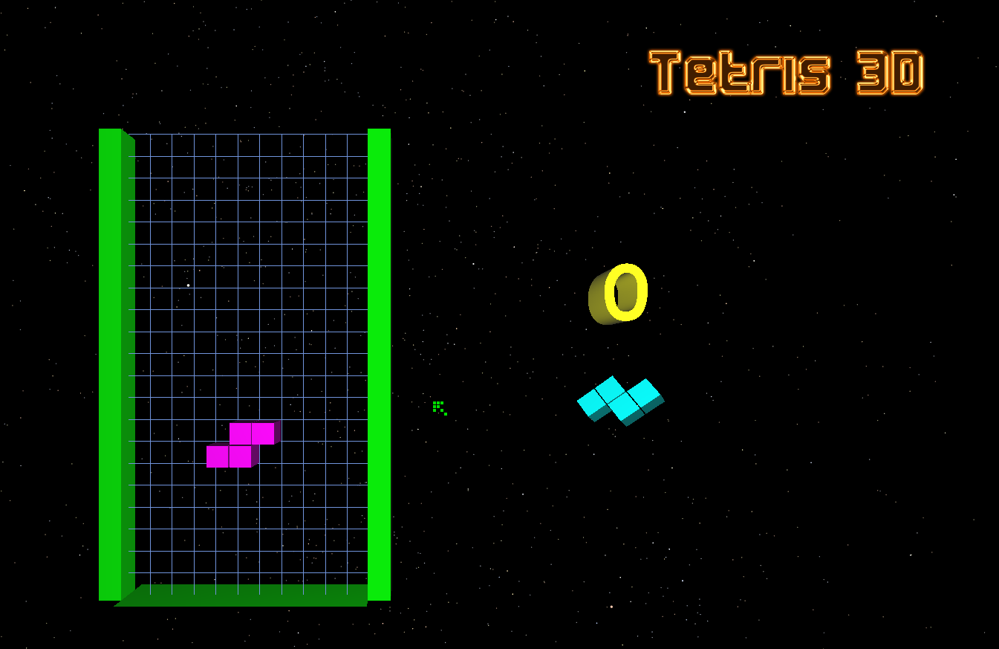

# Tetris-GLScene
Uma implementação do clássico Tetris feita em Delphi com GLScene

A principio isto é apenas uma experiência para eu avaliar meu ganho de experiência como programador, o código inicial foi criado por mim por volta de 2008 e é muito precário. Minha intenção é atualizá-lo e comparar com o resultado final.

## Histórico
**26/06/2020:** Subi o repositório como ele estava desde 2008, sem nenhuma atualização.

**30/06/2020:** Fiz a atualização para rodar com o GLScene mais atual. Apliquei formatação e refatorações mais gritantes.

## Idéias
Experimentar fazer um tetris usando o máximo de programação funcional possível.
- [Lab Assignment 3: Tetris (2018)](http://www.cse.chalmers.se/edu/year/2018/course/TDA555/lab3.html)
- [Functional Thread 13 : Tetris Game](https://mybroadband.co.za/forum/threads/functional-thread-13-tetris-game.1061448/)
- [Learning Modern JavaScript with Tetris](https://medium.com/@michael.karen/learning-modern-javascript-with-tetris-92d532bcd057)
